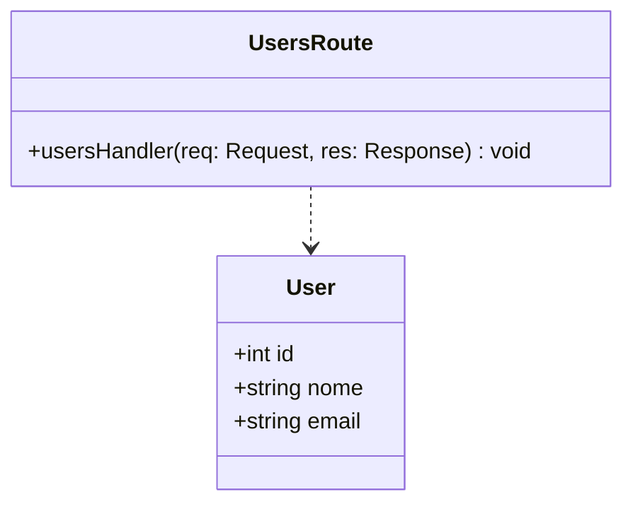

```mermaid
classDiagram
    class User {
        +int id
        +string nome
        +string email
    }
    class UsersRoute {
        +usersHandler(req: Request, res: Response) void
    }
    UsersRoute ..> User
```
