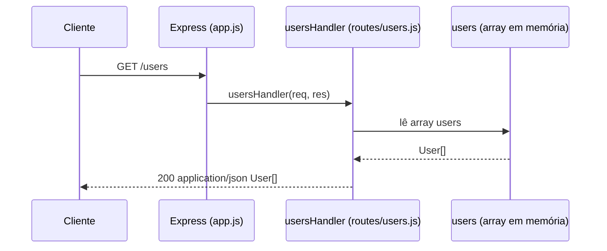

```mermaid
sequenceDiagram
    participant C as Cliente
    participant Ex as Express (app.js)
    participant H as usersHandler (routes/users.js)
    participant D as users (array em memória)

    C->>Ex: GET /users
    Ex->>H: usersHandler(req, res)
    H->>D: lê array users
    D-->>H: User[]
    H-->>C: 200 application/json User[]
```
